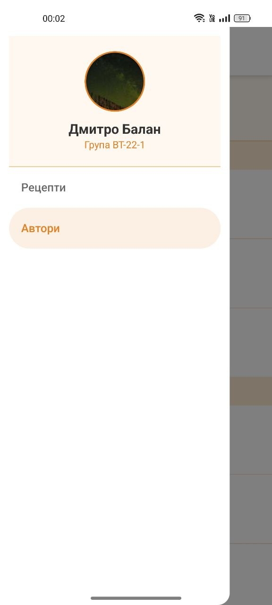
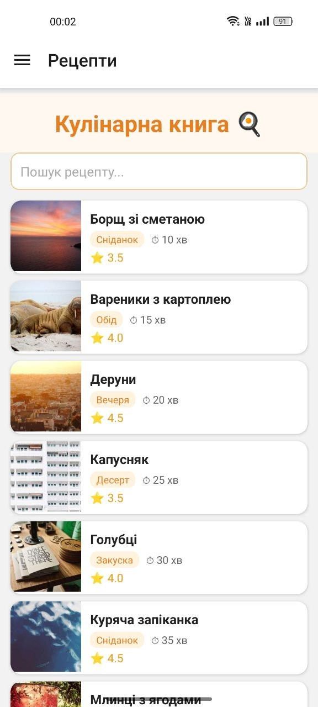
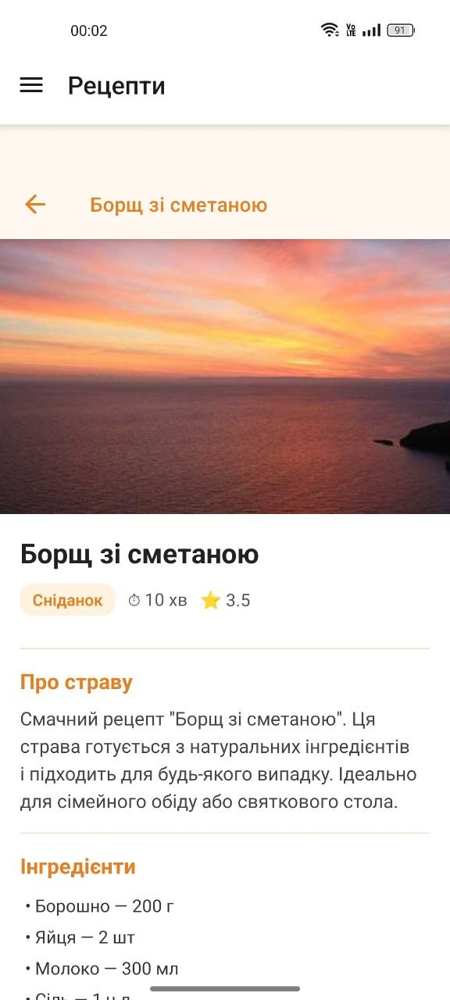
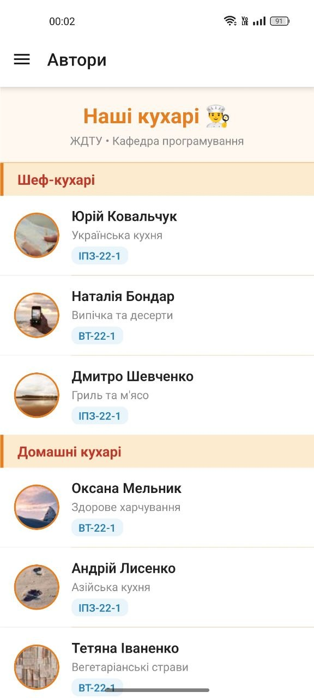

# Lab2 - Мобільний Додаток з Навігацією та Списками

##  Інструкція Запуску

### Передумови
- Node.js та npm встановлені
- Expo CLI встановлено глобально (`npm install -g expo-cli`)
- Expo Go додаток встановлено на телефон

### Крокі для запуску

1. **Клонувати/відкрити проект:**
```bash
cd Lab2/Lab2
```

2. **Встановити залежності:**
```bash
npm install --legacy-peer-deps
```

3. **Запустити Expo сервер:**
```bash
npm start
# або
npx expo start --clear
```

4. **Завантажити на телефон:**
   - Відскануйте QR код камерою (iOS) або Expo Go (Android)
   - Додаток завантажиться та запуститься на вашому пристрої

### Альтернативні способи запуску
```bash
npm run android    # Запуск на Android емуляторі
npm run ios        # Запуск на iOS симуляторі
npm run web        # Запуск у веб-браузері
```

---

##  Опис Реалізованого Функціоналу

### Архітектура Додатку

Додаток демонструє складну навігацію з використанням **Drawer Navigator** та **Stack Navigator**:

```
App (Drawer Navigation)
├── Новини (News Stack)
│   ├── MainScreen (FlatList з новинами)
│   └── DetailsScreen (Деталі новини)
└── Контакти (ContactsScreen з SectionList)
```

### Основні Компоненти

#### 1. **MainScreen** - Стрічка новин
- **Компонент:** FlatList
- **Функціональність:**
  - Відображення списку новин з зображеннями та описом
  - Pull-to-refresh функція для оновлення даних
  - Динамичне завантаження додаткових новин при прокручуванні (infinite scroll)
  - Оптимізована продуктивність завдяки віртуалізації
  - Розділювачі між елементами

```javascript
<FlatList
  data={data}
  renderItem={renderItem}
  refreshing={isRefreshing}
  onRefresh={handleRefresh}
  onEndReached={handleLoadMore}
  ListHeaderComponent={<Text>Стрічка новин</Text>}
  ListFooterComponent={...}
  ItemSeparatorComponent={() => <View/>}
/>
```

#### 2. **DetailsScreen** - Деталі новини
- Відображення повної інформації про вибрану новину
- Динамичний заголовок екрану
- Великі зображення та розширений опис

#### 3. **ContactsScreen** - Контакти
- **Компонент:** SectionList
- **Функціональність:**
  - Групування контактів за категоріями (Викладачі, Студенти)
  - Заголовки для кожної секції
  - Зручна організація даних

```javascript
<SectionList
  sections={contactsData}
  renderItem={({ item }) => <Text>{item.name}</Text>}
  renderSectionHeader={({ section: { title } }) => <Text>{title}</Text>}
/>
```

#### 4. **CustomDrawerContent** - Меню навігації
- Користувацький профіль з аватаром
- Інформація про групу
- Навігаційні пункти

### Дизайн та UI

- **Мінімалістичний дизайн** з чистою типографікою
- **Адаптивність** для різних розмірів екранів
- **Інтуїтивна навігація** з меню боковим меню (Drawer)
- **Затишний стиль** з сірими розділювачами та правильним паддингом

---

##  Скріншоти Роботи Додатку





##  Загальні Висновки

1. **FlatList та SectionList** - це потужні компоненти для оптимізованого відображення великих списків
2. **Віртуалізація** - критично важлива техніка для забезпечення плавної роботи мобільних додатків
3. **Передача параметрів** - важлива для комунікації між екранами
4. **Вкладена навігація** - забезпечує логічну організацію складних додатків
5. **SectionList** - помічна для структурування та групування даних


