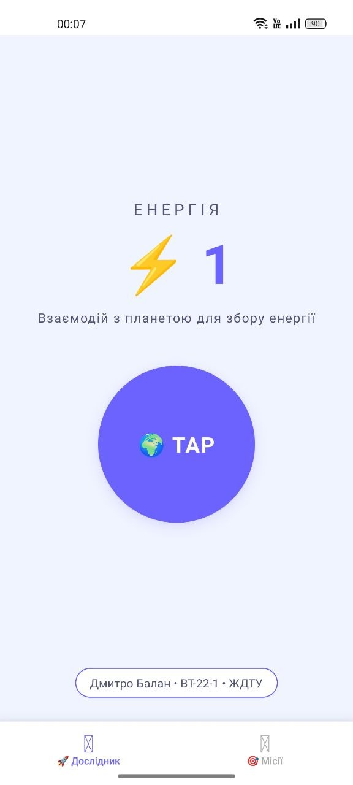
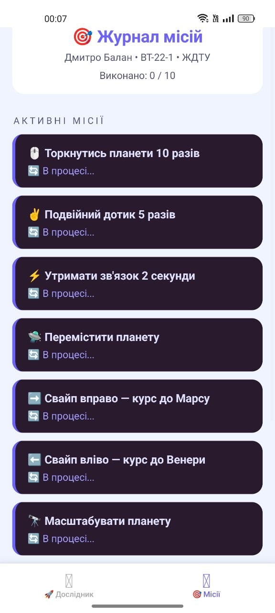

# Лабораторна робота №3: Gesture Clicker

## Опис реалізованого функціоналу
Мобільний додаток "Gesture Clicker" розроблено з використанням React Native. 
Реалізовано взаємодію з об'єктом за допомогою різних типів жестів (`TapGestureHandler`, `LongPressGestureHandler`, `PanGestureHandler`, `FlingGestureHandler`, `PinchGestureHandler`). 
Додано глобальний стан для підрахунку очок та відстеження виконання завдань (Challenges). 
Реалізовано дві теми (світла та темна) за допомогою `styled-components` та навігацію між екранами через `@react-navigation/native`.

## Інструкція запуску
1. Склонуйте репозиторій.
2. Встановіть залежності командою: `npm install`
3. Запустіть проєкт: `npx expo start`
4. Відкрийте додаток на емуляторі або фізичному пристрої через Expo Go.

## Скріншоти роботи застосунку

## Висновки
Під час виконання лабораторної роботи було успішно освоєно роботу з бібліотекою `react-native-gesture-handler`. Навчено обробляти базові та складні жести, уникати конфліктів між ними (наприклад, між одинарним та подвійним тапом). Також було закріплено навички роботи зі `styled-components` для стилізації та підтримки різних тем оформлення.