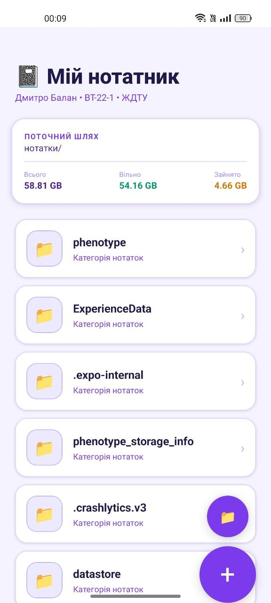

# Лабораторна робота №4: Mobile File Manager

Мобільний застосунок для роботи з файлами у локальному сховищі Expo (`documentDirectory`).

## Опис

Проєкт реалізує базовий файловий менеджер із можливістю:

- переглядати вміст поточного каталогу;
- переходити в підкаталоги та повертатися на рівень вище;
- створювати текстові файли та папки;
- відкривати текстовий редактор для файлів;
- перейменовувати та видаляти об'єкти;
- переглядати інформацію про пам'ять пристрою.

## Технології

- React Native (Expo)
- React Navigation (Stack Navigator)
- Expo FileSystem
- Styled Components
- React Native Safe Area Context

## Структура проєкту

```text
Lab4/
├── App.js
├── src/
│   ├── screens/
│   │   ├── FileManager.js
│   │   └── FileEditor.js
│   ├── components/
│   │   └── FileItem.js
│   └── utils/
│       └── formatters.js
├── assets/
└── README.md
```

## Запуск проєкту

1. Встановити залежності:

```bash
npm install
```

2. Запустити застосунок:

```bash
npx expo start
```

3. Відкрити проєкт у емуляторі або через Expo Go.

## Скріншоти



## Примітки

- Усі файлові операції виконуються в межах ізольованого сховища застосунку.
- Інтерфейс адаптований під безпечні зони екрана (notch, системні панелі).

## Висновок

У межах лабораторної роботи реалізовано повноцінний мобільний файловий менеджер на React Native. Застосунок демонструє використання локальної файлової системи, навігації між екранами, кастомних компонентів інтерфейсу та базових операцій керування файлами й папками.
