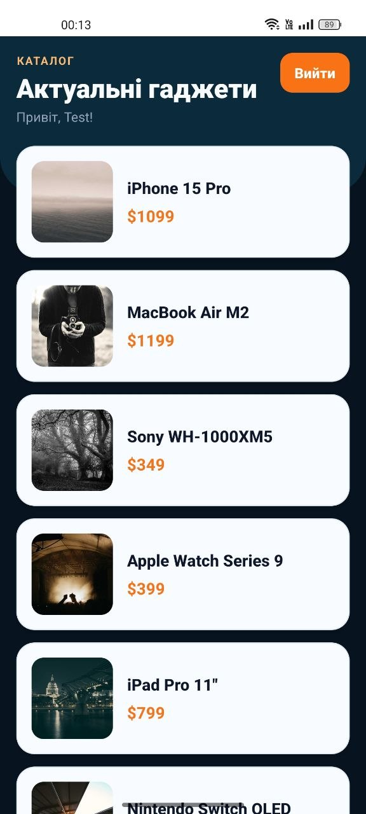
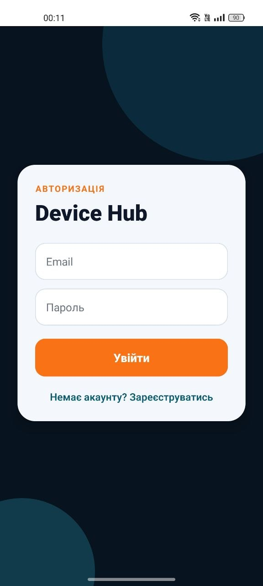

# Лабораторна робота 5: Expo Router + Auth + Каталог

**Виконав:** Балан Дмитро, ВТ-22-1

Мобільний застосунок на Expo Router з авторизацією, захищеними маршрутами та екраном деталей товару.

## Що реалізовано

- Вхід та реєстрація з валідацією полів (email-формат, мінімальна довжина пароля, збіг паролів).
- Захищена група маршрутів через Auth Guard у `(app)/_layout.js`.
- Каталог товарів на `FlatList` із вітанням авторизованого користувача.
- Динамічна сторінка деталей товару за `id` через `useLocalSearchParams()`.
- Глобальний стан авторизації через `AuthContext` з `currentUser`.
- Кастомний 404-екран для неіснуючих маршрутів.

## Структура проєкту

```text
app/
    _layout.js
    +not-found.js
    (auth)/
        login.js
        register.js
    (app)/
        _layout.js
        index.js
        details/
            [id].js
context/
    AuthContext.js
data/
    products.js
```

## Запуск

1. Встановити залежності:

```bash
npm install
```

2. Запустити застосунок:

```bash
npx expo start
```

3. Відкрити в Expo Go або емуляторі.

## Скріншоти




## Контрольні запитання

1. Перенаправлення неавторизованого користувача реалізується через захищений layout у `(app)/_layout.js`. Компонент перевіряє `isAuthenticated` і, якщо `false`, повертає `<Redirect href="/login" />`.

2. Компонент `Link` — для декларативної навігації прямо у JSX-розмітці. Метод `router.replace()` / `router.push()` — для програмної навігації всередині функцій (наприклад, після валідації форми).

3. Динамічні маршрути створюються файлом у квадратних дужках (`[id].js`). Значення отримується через хук `useLocalSearchParams()`, який повертає об'єкт з параметрами поточного URL.

4. `React Context API` зручний для стану авторизації, бо він потрібен одночасно багатьом екранам. Контекст усуває prop drilling та централізує логіку входу/виходу.

5. Групи маршрутів `(auth)` і `(app)` логічно розділяють екрани та задають різні layout-структури. Дужки у назві папки означають, що вона не включається в URL — це лише організаційна обгортка.

## Технології

- React Native
- Expo
- Expo Router
- React Context API
- StyleSheet + Animated API
