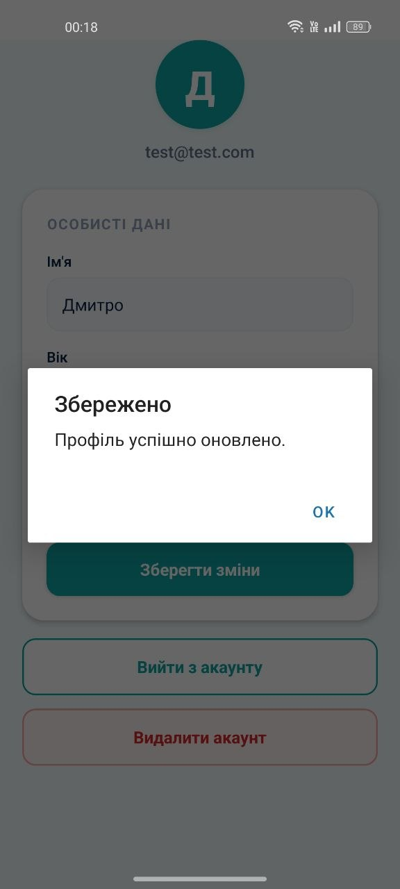
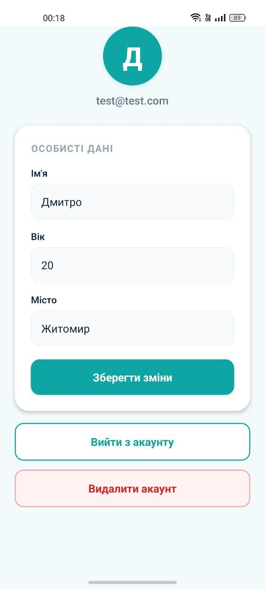
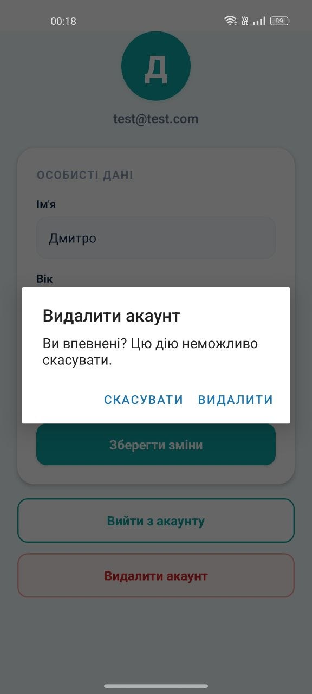

# Лабораторна робота №6: Інтеграція Firebase у React Native (Expo)

**Виконав:** Балан Дмитро, ВТ-22-1

## Огляд проєкту

Мобільний застосунок на Expo Router з інтеграцією Firebase Authentication та Cloud Firestore. Реалізовано авторизацію користувачів, збереження та редагування профілю у хмарі, захищену навігацію та видалення акаунта.

## Реалізований функціонал

### Авторизація
- Реєстрація нового облікового запису через Email/Password.
- Вхід у застосунок для існуючих користувачів.
- Відновлення пароля через лист на email.
- Вихід із системи.
- Видалення акаунта разом із документом Firestore.

### Робота з даними (Firestore)
- Автоматичне створення документа користувача у колекції `users` після реєстрації.
- Завантаження профілю при вході.
- Збереження та редагування полів: ім'я, вік, місто.
- Прив'язка документа до `uid` користувача.

### Навігація та безпека
- Публічна група маршрутів `(auth)` — login, register.
- Захищена група маршрутів `(app)` з Auth Guard та індикатором завантаження.
- Firestore Rules: читання/запис лише свого документа.
- Централізований стан авторизації через `AuthContext` + `onAuthStateChanged`.

## Структура проєкту

```text
├── app/
│   ├── _layout.js           — кореневий layout з AuthProvider
│   ├── +not-found.js        — кастомний 404-екран
│   ├── (app)/
│   │   ├── _layout.js       — Auth Guard
│   │   └── index.js         — екран профілю
│   └── (auth)/
│       ├── _layout.js
│       ├── login.js
│       └── register.js
├── context/
│   └── AuthContext.js       — Firebase auth + стан
└── firebaseConfig.js        — ініціалізація Firebase
```

## Налаштування Firebase

1. Створити проєкт у [Firebase Console](https://console.firebase.google.com/).
2. Додати Web app і скопіювати конфігурацію у `firebaseConfig.js`.
3. Увімкнути **Authentication → Sign-in method → Email/Password**.
4. Створити **Firestore Database**.
5. Налаштувати правила доступу (див. нижче).

## Firestore Rules

```javascript
service cloud.firestore {
  match /databases/{database}/documents {
    match /users/{userId} {
      allow read, write: if request.auth != null && request.auth.uid == userId;
    }
  }
}
```

## Скріншоти





## Запуск

```bash
npm install
npx expo start
```

## Технологічний стек

- React Native (Expo)
- Expo Router
- Firebase Authentication
- Cloud Firestore
- AsyncStorage
- JavaScript
