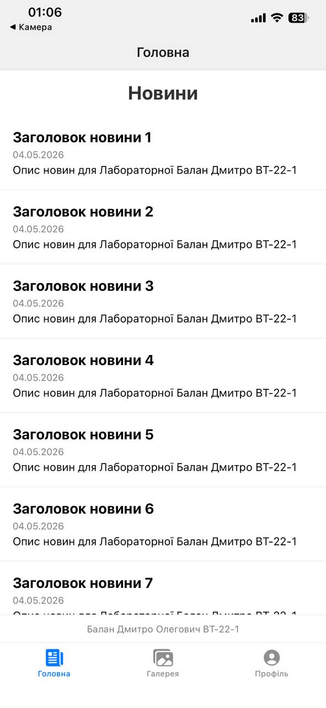
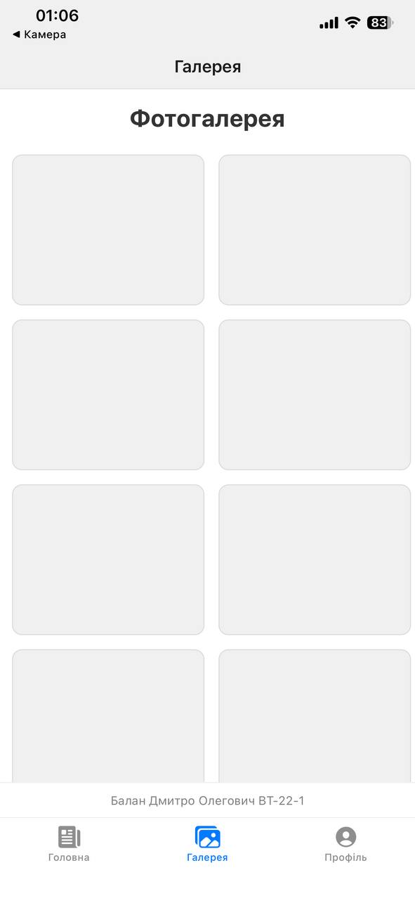
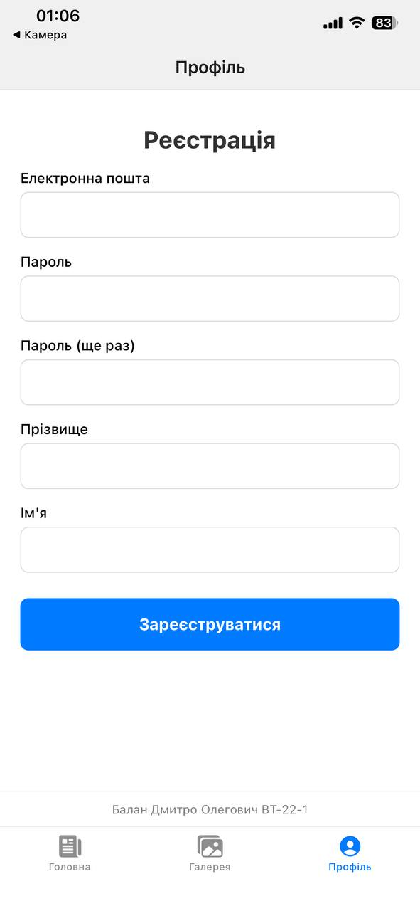

# MobileLabsRN2026

Даний репозиторій містить комплекс лабораторних робіт з дисципліни "Розробка мобільних додатків". Усі проєкти реалізовані з використанням фреймворку React Native та інструментарію Expo.

## Загальні вимоги для розгортання

Для коректного запуску проєктів необхідно встановити:

- Node.js (LTS версія)
- Git
- Застосунок Expo Go на мобільному пристрої (iOS/Android)

---

## Лабораторна робота №1

**Тема:** Використання Expo для створення додатку React Native та робота з базовими компонентами.

### Опис функціоналу

У рамках роботи було реалізовано мобільний додаток з трьома екранами на базі Bottom Tab Navigation:

1. **Головна:** Виведення списку новин через компонент FlatList.
2. **Фотогалерея:** Сітка зображень з використанням властивості numColumns.
3. **Профіль:** Форма реєстрації користувача з використанням TextInput та TouchableOpacity.

### Інструкція із запуску (iOS)

1. Перейти в каталог лабораторної роботи:

```bash
cd lab1
```

2. Встановити необхідні залежності:

```bash
npm install
```

3. Запустити Metro Bundler:

```bash
npx expo start --tunnel
```

4. Відкрити стандартний застосунок "Камера" на iPhone та відсканувати QR-код для відкриття через Expo Go.

### Скріншоти виконання

| Головний екран | Фотогалерея | Профіль (Реєстрація) |
|---|---|---|
|  |  |  |

---

## Методи запуску та тестування

Відповідно до вимог лабораторної роботи, були використані наступні методи тестування додатка:

1. **Physical Device (iPhone + Expo Go):** Тестування на реальному пристрої для перевірки жестів iOS та коректності відображення інтерфейсу в межах Safe Area.
2. **iOS Simulator:** Запуск через Xcode Simulator для перевірки адаптивності інтерфейсу під різні моделі iPhone.
3. **Tunnel Mode:** Використання прапорця `--tunnel` для забезпечення стабільного зв'язку між робочою станцією та смартфоном через віддалений проксі-сервер Expo.

---

Виконав: **Дмитро Балан ВТ-22-1**
